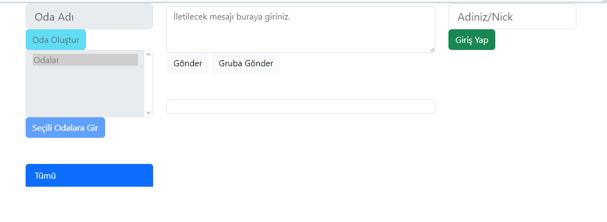

# Chatroom Application

## Overview
This Chatroom application is a platform where users can join chat rooms for group messaging or send direct messages to each other. It facilitates real-time communication among users in a seamless and efficient manner.

## Features

- **Chat Rooms:** Users can join various chat rooms and participate in group conversations.
- **Direct Messaging:** Enables users to send private messages directly to other individuals.
- **Real-Time Communication:** Instant message delivery and real-time interaction.
- **User-Friendly Interface:** Developed using JQuery for a smooth and responsive user experience.
- **Efficient Backend:** Robust and scalable server-side management with .NET Core.

## Technical Details

- **Frontend:** Implemented with JQuery for a responsive and interactive user interface.
- **Backend:** Powered by .NET Core, ensuring efficient and scalable backend operations.
- **Database:** Uses MSSQL for secure and reliable data storage.
- **Real-Time Operations:** Real-time messaging facilitated by SignalR.

